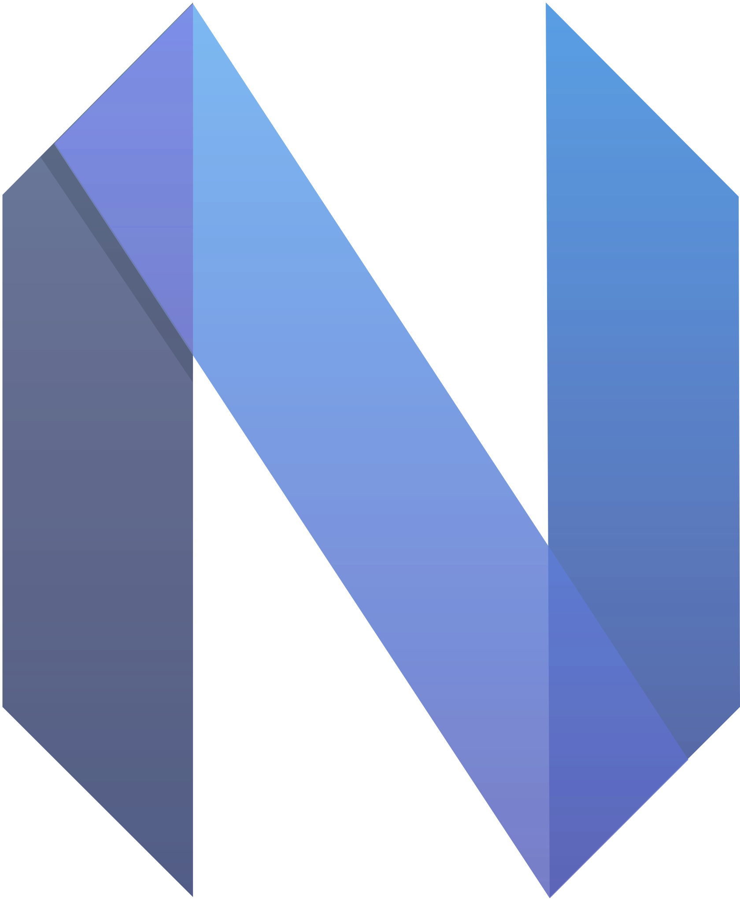
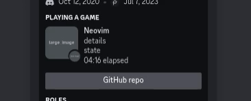
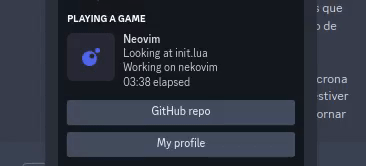

<div align='center'>
  

  # <samp>[NekoVim](https://github.com/pandasoli/nekovim)</samp>
  Discord [Rich Presence](https://discord.com/rich-presence) plugin for [Neovim](https://neovim.io)

  <br/>
  

  <br/>
  <div align='center'>

  
  
  [](LICENSE)

  
  
  </div>
</div>

<br/>
<br/>

## Features 

- Fast
- No dependencies
- Auto presence update
- Multiple instances
- Really highly configurable

  > The only thing you "cannot change" is the text “Playing **Neovim**”.  
  > Actually, you can! But it would require [changing the Discord bot](./docs/work_props.md).

<br/>
<br/>
<div align='right'>

  ##  Requirements
</div>

I didn't fully tested, but I made with the following versions.  
If any bug occur, please let me know.

<br/>

- NVIM `v0.9.2`  
  LuaJIT `2.1.1693350652`

<br/>
<br/>

## Installation 

Add this repo (`pandasoli/nekovim`) to your plugins list.

> [!NOTE]
> Multi-instance does _not_ work on Windows yet.  
> It should be working but for some reason it's not, I'm accepting pull requests.

<br/>
<br/>
<div align='right'>

##  Configuration
</div>

The `Nekovim.setup` function is used to set up the plugin.  
If you don't configure, it's gonna use [the default config](./lua/default_makers/init.lua).

<br/>
<div align='center'>
  
  
</div>
<br/>

```lua
---@type func(PresenceMakers, WorkPropsMakers)
require 'nekovim'.setup {}
```

More info about **Presence Makers** in [Presence Table](./docs/presence_table.md).  
I explain more about **Work Props** in [Work Props](./docs/work_props.md).

<br/>
<br/>

## Development 

Before creating a pull request, read the [docs for developers](./DEVELOPMENT.md)   
We have also [some tasks to be done](./docs/todo.md) if you would like to help 

<br/>

I didn't know anything about creating a plugin before having troubles with other rich presence plugins.  
I'd like to thank [andweeb/presence.nvim](https://github.com/andweeb/presence.nvim), their code helped me a lot developing **NekoVim**.
