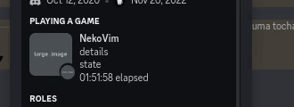

# Neko[Vim](https://vim.org)   

<div align='center'>

  > Discord [Rich Presence](https://discord.com/rich-presence) plugin for [Neovim](https://neovim.io)

  
  [](https://opensource.org/licenses/MIT)

  <br/>

  [**Features**](#features-) | [**Instalation**](#-installation) |
  [**Configuration**](#configuration-) | [**Development**](#-development)
</div>
<br/>
<br/>

## Features 

- Fast
- No dependencies
- Auto presence update
- Multiple instances
- Really highly configurable

  > The only thing you "cannot change" is the text “Playing **Neovim**”.  
  > Actually, you can! But it would require [changing the Discord bot](./docs/work_props.md).

<br/>
<br/>
<div align='right'>

  ##  Installation
</div>

Add this repo (`pandasoli/nekovim`) to your plugins list.

<br/>
<br/>

## Configuration 
The function `Nekovim:setup` is used to set up the plugin.  
If you don't configure it'll start with [a default config](./lua/default_makers/init.lua).

<br/>
<div align='center'>
  
</div>
<br/>

```lua
---@type func(PresenceMakers, WorkPropsMakers)
require 'Nekovim':setup {}
```

More info about **Presence Makers** in [Presence Table](./docs/presence_table.md).  
I explain more about **Work Props** in [Work Props](./docs/work_props.md).

<br/>
<br/>
<div align='right'>

  ##  Development
</div>

Before creating a pull request, read the [docs for developers](./DEVELOPMENT.md) .  
We have also [some tasks to be done](./docs/todo.md) if you would like to help .

<br/>

I didn't know anything about creation of plugins before having troubles with other rich presence plugins.  
A lot of code from [andweeb/presence.nvim](https://github.com/andweeb/presence.nvim) was used, so I would like to thanks them.
