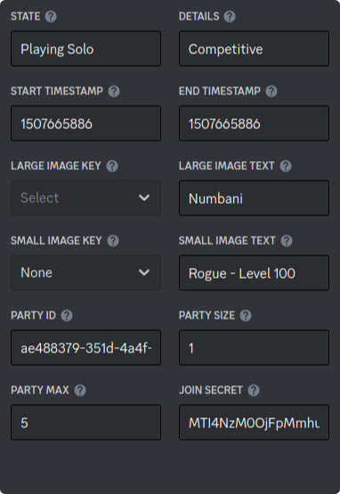

<div align='center'>

  # Presence table 
</div>

The presence table that **Discord** expects:



```lua
---@class PresenceButton
---@field label string
---@field url   string

---@class PresenceAssets
---@field large_image? string
---@field large_text?  string
---@field small_image? string
---@field small_text?  string

---@class PresenceTimestamps
---@field start? integer
---@field end?   integer

---@class Presence
---@field state?      string
---@field details?    string
---@field timestamps? PresenceTimestamps
---@field assets?     PresenceAssets
---@field buttons?    PresenceButton[]
```
> <small><code>lua/deps/discord/types/activity.lua</code></small>

<br/>
<br/>
<div align='center'>

  # Presence Makers 
</div>

We use **Presence Makers** to generate the _Presence Table_.

They are structured as the _Presence Table_.  
Their fields can be a function that returns the expected value or it directly.

<details>
  <summary>See declaration</summary>

  ```lua
  ---@class PresenceMakersAssets : PresenceAssets
  ---@field large_image? (fun(self: NekoVim): string)|string
  ---@field large_text?  (fun(self: NekoVim): string)|string
  ---@field small_image? (fun(self: NekoVim): string)|string
  ---@field small_text?  (fun(self: NekoVim): string)|string

  ---@class PresenceMakersTimestamps : PresenceTimestamps
  ---@field start? (fun(self: NekoVim): integer)|integer
  ---@field end?   (fun(self: NekoVim): integer)|integer

  ---@class PresenceMakers : Presence
  ---@field state?     (fun(self: NekoVim): string)|string
  ---@field details?   (fun(self: NekoVim): string)|string
  ---@field timestamps PresenceMakersTimestamps
  ---@field assets?    PresenceMakersAssets
  ---@field buttons?   ((fun(self: NekoVim): PresenceButton)|PresenceButton)[]
  ```
  > <small><code>lua/types/presence_makers.lua</code></small>
</details>

<br/>
<br/>

The functions receive an instance of **NekoVim** because of:  

You can omit this param if you don't need it.

<details>
  <summary><code>NekoVim.buffer_props</code></summary>

  ```lua
  ---@class BufferProps
  ---@field mode          'n'|'i'|'v'|'c'|'R'|string
  ---@field repoName      string
  ---@field fileName      string?
  ---@field filePath      string?
  ---@field fileType      string?
  ---@field fileExtension string?
  ```
  > <small><code>lua/types/buffer_props.lua</code></small>
</details>
<details>
  <summary><code>NekoVim.presence_props</code></summary>

  ```lua
  ---@class PresenceProps
  ---@field startTimestamp integer
  ---@field idling         boolean
  ```
  > <small><code>lua/types/presence_props.lua</code></small>

  <br/>

  See more about `idling` in _Work Props_.
</details>
